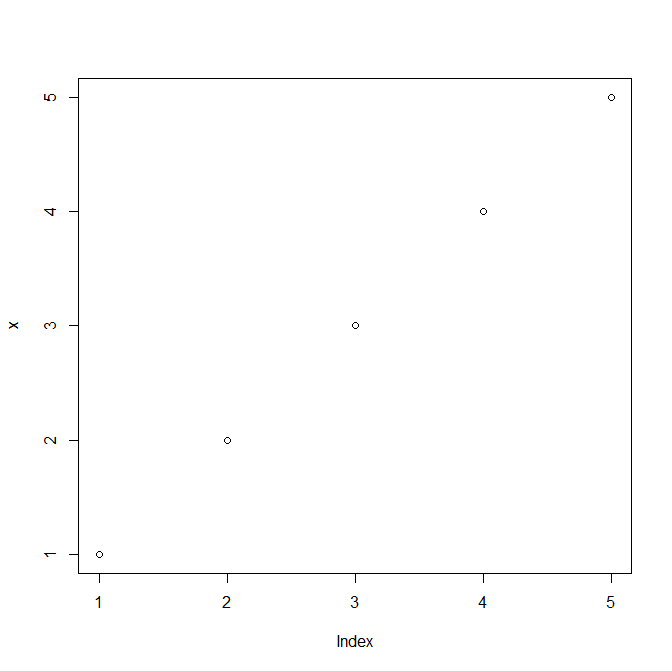

# 3. 데이터 열기, 저장하기

## 1. 비정형 데이터 가져오기 
### readLines()
```R
# 현재 작업중인 폴더
getwd()

# 작업 폴더 변경
setwd("c:/temps")

# temps 폴더 내 파일 보여줌
list.files()

#
review = readLines("구매후기_utf8.txt",encoding="UTF-8")
```  

## 2. 정형 데이터 가져오기
### 1. 표 읽기, read.table()
- 데이터 많을 때는 read.table()보다 data.table()이 더 빠름
```R
#read.table
major1 = read.table("전공1.txt")
```
ouput:
```R
    V1     V2         V3
1 학번   이름       전공
2 1001 홍길동 컴퓨터공학
3 1002 알지매   전자공학
4 1003 강감찬   산업공학

```

```R
major2 = read.table("전공2.txt", header=TRUE, sep=":")
```

ouput:
```R
  학번   이름       전공
1 1001 홍길동 컴퓨터공학
2 1002 알지매   전자공학
3 1003 강감찬   산업공학
```
### 2. CSV 읽기, read.csv()
```R
major3 = read.csv("전공3.txt")
```

### 3. Excel 읽기, readxl()
```R
install.packages("readxl")
library("readxl")
major4=read_excel("c:/temps/전공4.xls",sheet=1)
major3
```
ouput:
```R
# A tibble: 3 x 3
   학번 이름   전공      
  <dbl> <chr>  <chr>     
1  1001 홍길동 컴퓨터공학
2  1002 일지매 전자공학  
3  1003 강감찬 산업공학
```  
#
```R
시트지정
major5=read_excel("c:/temps/전공4.xls",sheet="2학기")
```
output:
```R
# A tibble: 3 x 3
   학번 이름     전공      
  <dbl> <chr>    <chr>     
1  1004 홍길순   컴퓨터공학
2  1005 전우치   전자공학  
3  1006 을지문덕 산업공학  

```

### 4. 사용자로부터 입력 받기
- 간단한 숫자나 단어(공백으로 구분) 입력 받을 때
#### 1. 실수 입력
    
```R
line = scan()
```

output:
```R
1: 1
2: 2
3: 5
4: 
Read 3 items
```
#### 2. 단어 입력
```R    
line = scan(what='')
``` 

ouput:
```R
Read 3 items
> line = scan(what='')
1: 홍길동 일지매
3: 강감찬
4: 
Read 3 items
> line
[1] "홍길동" "일지매" "강감찬"
```
#### 3. 문장입력
```R
line = readline("프로그래밍 언어 아무거나 쓰시오 : ")
```
ouput:
```R
프로그래밍 언어 아무거나 쓰시오 : R
```
```R
line
```
ouput:
```R
"R"
``` 

#### 4. PDF 파일 읽기
- pdftools외에도 tm도 있음
```R
install.packages("pdftools")
library("pdftools")
list.files(pattern="pdf$")
```
output:
```R
[1] "kor.pdf"
```   
```R
cat(pdf[1])
```
ouput:
```R
   CTPRVN_CDCTP_ENG_NM CTP_KOR_NM

 0       11 Seoul      서울특별시

 1       26 Busan      부산광역시

 2       27 Daegu      대구광역시

 3       28 Incheon    인천광역시

 4       29 Gwangju    광주광역시

 5       30 Daejeon    대전광역시

 6       31 Ulsan      울산광역시
....
```

#### 5. SPSS/SAS 읽기
- SPSS

```R
install.packages("foreign")
library("foreign")
spss = read.spss("filename.sav", to.data.frame=TRUE)
```

- SAS
```R    
install.packages("foreign")
library("foreign")
sas = read.ssd(libname="c:/path", sectionnames="section_name", sascmd="C:/Program Files/SAS 설치된 경로");
```

## 3. 데이터 저장하기
### 1. write()/writeLines()
- 비정형 데이터 저장
### 2. write.table() 
```R
major = read.table("전공.txt", header=TRUE)
write.table(major, "전공_저장.txt")
```
ouput:
```R
전공_저장 파일 내용:
"학번" "이름" "전공"
"1" 1001 "홍길동" "컴퓨터공학"
"2" 1002 "알지매" "전자공학"
"3" 1003 "강감찬" "산업공학"
```

### 3. write.csv() : csv로 저장
```R
write.table(major, "전공csv_저장.txt")
```
ouput:
```R
전공csv_저장 파일 내용:
"학번" "이름" "전공"
"1" 1001 "홍길동" "컴퓨터공학"
"2" 1002 "알지매" "전자공학"
"3" 1003 "강감찬" "산업공학"
```

### 4. write.xls() : xls로 저장
```R
install.packages("xlsx")
library("xlsx")
write.xlsx(major, "major_xls.xls")
```
### 5. SPSS/SAS로 저장
- SPSS
    ```R
    write.foreign(major, datafile="file name.txt", codefile="file name.sas", package="SPSS")
    ```
- SAS
    ```R
    write.foreign(major, datafile="file name.txt", codefile="file name.sas", package="SAS")
    ```
    
### 6. SavePlot() : 그림으로 저장
```R
x = c(1,2,3,4,5)
plot(x)
# 그래프 켜져있는 상태여야 
savePlot("R_image_save.png", type="png")
```
#### 작업폴더 내 파일 생성

